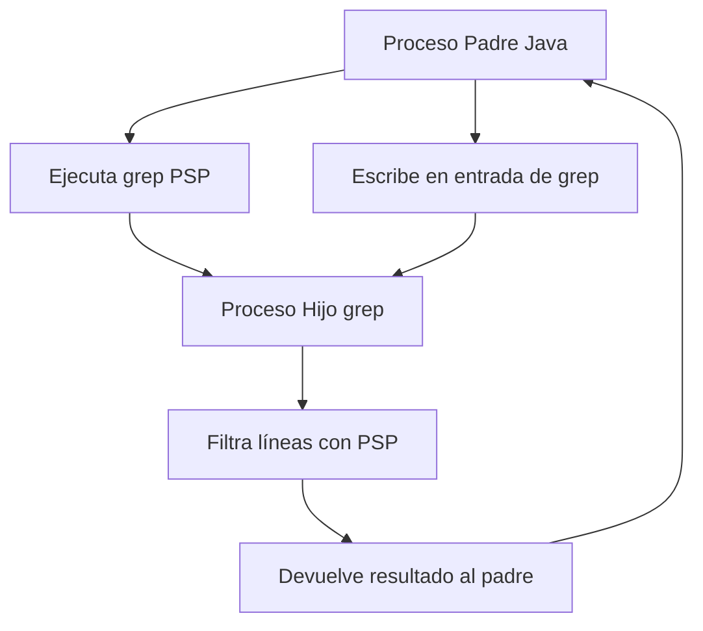

# PSP Ejercicio Grep

Este proyecto muestra cómo escribir en la entrada estándar de un proceso hijo desde un proceso padre en Java. En particular, el ejemplo lanza el comando `grep psp` de Linux y escribe texto en su entrada estándar.

## Descripción del Proceso

1. **Proceso Padre**: Un programa Java que crea un proceso hijo.
2. **Proceso Hijo**: El comando `grep psp` de Linux, que busca la cadena "psp" en el texto que recibe por la entrada estándar.
3. **Comunicación**: El proceso padre escribe texto en la entrada estándar del proceso hijo.

## Flujo del Proceso



## Cómo Funciona la Escritura en el Proceso Hijo

La comunicación del proceso padre con el proceso hijo se basa en la redirección de flujos de entrada y salida. A continuación, se explican las etapas clave con fragmentos de código:

### 1. Crear el proceso hijo

```java
// Definir el comando a ejecutar
String[] comando = {"grep", "PSP"};
// Crear el proceso hijo
Process proceso = Runtime.getRuntime().exec(comando);
```

Esta línea crea un nuevo proceso que ejecuta el comando `grep PSP`. El proceso hijo inicia su ejecución pero espera a que se le proporcione datos por su entrada estándar.

### 2. Obtener el flujo de salida conectado a la entrada del hijo

```java
// Obtener el OutputStream que conecta con la entrada estándar del proceso hijo
OutputStream outputStream = proceso.getOutputStream();
// Envolver en un PrintWriter para facilitar la escritura de líneas
PrintWriter writer = new PrintWriter(new OutputStreamWriter(outputStream));
```

El método `getOutputStream()` del objeto `Process` devuelve un flujo que, cuando se escribe en él, envía datos directamente a la entrada estándar del proceso hijo (`grep` en este caso).

### 3. Escribir datos en el proceso hijo

```java
// Escribir líneas de texto en el proceso hijo
writer.println("Me gusta PSP y java");
writer.println("PSP se programa en java");
// ... más líneas ...

// Importante: flush y cerrar el flujo para que el proceso hijo reciba todos los datos
writer.flush();
writer.close();
```

Cada llamada a `println()` envía una línea de texto seguida de un salto de línea a la entrada estándar del proceso hijo. Es crucial llamar a `flush()` para asegurarse de que todos los datos se envíen, y a `close()` para indicar que no se enviarán más datos.

## Cómo Funciona la Lectura del Resultado en el Proceso Padre

Una vez que el proceso hijo ha procesado los datos, el proceso padre puede leer el resultado:

```java
// Obtener el InputStream que conecta con la salida estándar del proceso hijo
BufferedReader reader = new BufferedReader(
    new InputStreamReader(proceso.getInputStream()));

// Leer las líneas de resultado
String line;
System.out.println("Resultados del comando grep:");
while ((line = reader.readLine()) != null) {
    System.out.println(line);
}
reader.close();

// Esperar a que el proceso hijo termine y obtener su código de salida
int exitCode = proceso.waitFor();
```

El método `getInputStream()` del objeto `Process` devuelve un flujo que permite al proceso padre leer la salida estándar generada por el proceso hijo (las líneas que contienen "PSP" en este caso). Finalmente, `waitFor()` hace que el proceso padre espere a que el proceso hijo termine y devuelve su código de salida.


## Notas Importantes

- Este ejemplo está diseñado para entornos Linux o sistemas que tengan el comando grep disponible.
- En Windows, es posible que se necesite usar una herramienta similar o ejecutar el comando a través de una terminal Linux como WSL.
- Es importante cerrar los flujos de I/O después de usarlos para evitar fugas de recursos.
- Se debe manejar correctamente la finalización del proceso hijo y recoger su código de salida.

# Ruta GitHub
> https://github.com/liuDam1/psp_ejercicioGrep.git 